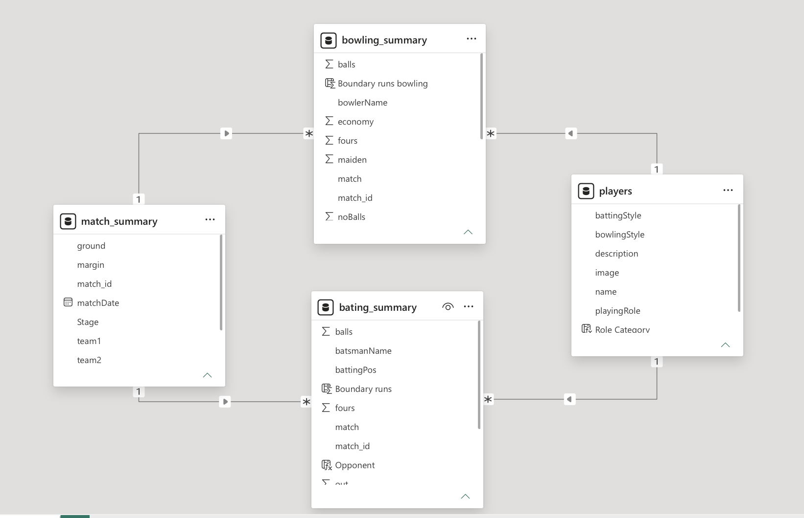

#  🏏 ICC Men's T20 World Cup 2022 — Analytics Intelligence Dashboard

> **A production-grade Power BI visual intelligence platform engineered for cricket selectors, coaches, and performance analysts — transforming raw match data into actionable, role-specific insights across 6 specialized analytical pages.**

---

## 📌 Table of Contents

1. [Project Overview](#project-overview)
2. [Live Dashboard Preview](#live-dashboard-preview)
3. [Key Dashboard Features](#key-dashboard-features)
4. [Tech Stack & Workflow](#tech-stack--workflow)
5. [Data Modeling & Architecture](#data-modeling--architecture)
6. [DAX Measures & Mathematical Formulas](#dax-measures--mathematical-formulas)
7. [Project Directory Structure](#project-directory-structure)
8. [Setup & Usage Guide](#setup--usage-guide)
9. [Future Enhancements](#future-enhancements)
10. [Contributing Guidelines](#contributing-guidelines)

---

## 🧠Project Overview

The **ICC Men's T20 World Cup 2022 Analytics Dashboard** is a multi-page, role-aware Power BI solution built to decode tournament performance data across **42 matches**, **16 teams**, **7 venues**, **213 players**, and **515 wickets**. The platform is structured as a **visual intelligence system** not merely a reporting tool designed to support strategic decisions such as squad selection, match-up analysis, and performance benchmarking.

The dashboard is segmented into **6 purpose-built pages**, each targeting a distinct cricket role category and analytical context. Every page follows a **consistent UX layout philosophy**: a top navigation/filter strip, a KPI ribbon, and a rich charts zone enabling progressive drill-down from tournament overview to granular player-level statistics.

### 🎯Business Objectives

| Objective | Description |
|-----------|-------------|
| **Performance Benchmarking** | Compare players across key metrics <br> — Strike Rate, Batting Average, Economy, Dot Ball % <br> — filtered by stage and role |
| **Role-Based Selection Intelligence** | Isolate Openers, Middle Order, All Rounders, and Bowlers with role-specific KPIs |
| **Venue & Stage Analysis** | Understand how runs, wickets, and team totals varied across venues and tournament phases |
| **Point Table Tracking** | Dynamic standings with live NRR calculation and win/loss records per team |
| **Statistical Leaderboards** | Top 5 performers across  batting and bowling dimensions on a unified Stats page |

---

## 📸Live Dashboard Preview

| Page | Description |
|------|-------------|
| **Overview** | Tournament-level KPIs, Point Table, Runs & Wickets by Venue |
| **Openers** | Batting leaders, Scatter chart (Avg vs SR), Highest Runs |
| **Middle Order** | Consistency Index leaders, role-filtered batting breakdown |
| **All Rounders** | Dual-axis comparison of batting avg, bowling avg, and economy |
| **Bowlers** | Economy/Wickets by bowler, bowling average scatter |
| **Stats** | Six chart leaderboards: Top batters, highest scores, best bowling figures |

>  [Check the Dashboard screenshots](/Assets/)

---

## 📊Key Dashboard Features

###  Page 1 — Tournament Overview

The entry point of the dashboard. Provides a **tournament-wide summary** for executives and broadcasters.

**KPIs Displayed:**
- `Players` · `Teams` · `Venues` · `Matches` · `Total Runs` · `Total Wickets`

**Visuals:**
-  **Dynamic Point Table** — Columns: Team, Pts, M, W, L, NRR (color-coded positive/negative NRR)
-  **Total Runs by Venue** — Area/line chart showing run distribution across all 7 Australian venues
-  **Total Wickets by Venue** — Bar chart ranked by wicket counts per ground
-  **Total Runs by Stage** — Stacked horizontal bar chart segmented by Group Stage, Playoffs, Super 12

**Filters:** Stage slicer (Group Stage · Playoffs · Super 12) | Navigation buttons to all pages

---

###  Page 2 — Openers Analysis

Focused on **batting position 1 & 2** players. Provides metrics critical for assessing top-order reliability.

**KPIs Displayed:**
- `Total Runs` · `Batting Average` · `Strike Rate` · `Boundary %` · `Total Ball Faced` · `Consistency Index`

**Visuals:**
-  **Batting Performance by Each Team** — Bubble/scatter chart (X: Batting Avg, Y: Strike Rate, bubble = team)
-  **Top 5 Players by Highest Runs** — Vertical bar chart with run tallies
-  **Detailed Player Table** — Player | Team | Opponent | Batting Style | Position | Runs | Balls | Fours | Sixes | Strike Rate | Boundary Runs | Avg Runs

**Key Highlight:** Max O'Dowd (242), Jos Buttler (225), Kusal Mendis (223), Pathum Nissanka (214), Alex Hales (212)

---

###  Page 3 — Middle Order Analysis

Targets **batting positions 3–6**. Emphasizes consistency and pressure-situation performance.

**KPIs Displayed:**
- `Total Runs` · `Batting Average` · `Strike Rate` · `Boundary %` · `Total Ball Faced` · `Consistency Index`

**Visuals:**
-  **Batting Performance by Team** — Scatter chart (Batting Avg vs Strike Rate) for middle-order batters
-  **Consistency Index by Player** — Horizontal bar chart (Top 5: Calum MacLeod 2400, Evin Lewis 1400, Gerhard Erasmus 900)
-  **Player Performance Table** — Same schema as Openers page with middle-order filter applied


---

###  Page 4 — All Rounders Analysis

Dual-dimensional view of players who contribute meaningfully **both with bat and ball**.

**KPIs Displayed:**
- `Total Runs` · `Batting Average` · `Strike Rate` · `Wickets` · `Bowling Average` · `Bowling Strike Rate`

**Visuals:**
-  **Most Reliable All Rounder** — Scatter chart (X: Strike Rate, Y: Bowling Economy) per team
-  **All Round Average Comparison** — Clustered bar + line chart showing Batting Avg, Bowling Avg, and Economy for Top 5 (Rashid Khan, David Wiese, Shadab Khan, JJ Smit, Jan Frylinck)
-  **Detailed All Rounder Table** — Player | Team | Opponent | Batting Style | Bowling Style | Runs | Wickets | Boundary % | Balls Bowled | Dot Ball % | Bowling Economy

---

###  Page 5 — Bowlers Analysis

Comprehensive bowling intelligence page for identifying match-winning and economical bowlers.

**KPIs Displayed:**
- `Balls Bowled` · `Wickets` · `Bowling Economy` · `Bowling Average` · `Bowling Strike Rate` · `Dot Ball %`

**Visuals:**
-  **Bowling Economy & Wickets by Bowler** — Grouped bar chart (Nasum Ahmed 3.5, Moeen Ali 4.5, Jason Holder 4.7)
-  **Bowling Average & Wickets by Bowler** — Dual-line chart (Glenn Maxwell 6.3 avg, Anrich Nortje 8.5 avg / 11 wickets)
-  **Detailed Bowler Table** — Player | Team | Opponent | Bowling Style | Balls | Wickets | Run Conceded | Sixes | Fours | Wide Balls | Boundary Runs

---

###  Page 6 — Stats Leaderboard

A **six-panel statistical showcase** — the tournament's definitive record page.

| Panel | Metric | #1 Performer |
|-------|--------|--------------|
| Top 5 Batters by Runs | Total Runs | Virat Kohli — 296 |
| Top 5 Highest Scores | Single Innings | Rilee Rossouw — 109 |
| Top 5 Batters by Batting Avg | Batting Average | Virat Kohli — 99 |
| Top 5 Bowlers by Wickets | Wicket Count | Wanindu Hasaranga — 15 |
| Top 5 Bowlers by Economy | Bowling Economy | Nasum Ahmed — 3.5 |
| Top 5 Bowlers by Bowling Avg | Bowling Average | Glenn Maxwell — 6.3 |

---

## ⚙️Tech Stack & Workflow

```
Raw CSV/Excel Data
        │
        ▼
 ┌──────────────────┐
 │  Python (Pandas) │  ← Data Cleaning, Normalization, Type Casting
 └──────────────────┘
        │
        ▼
 ┌──────────────────────────────────────────┐
 │         Power BI Desktop (.pbix)         │
 │                                          │
 │  Power Query  →  Data Modeling (Star)    │
 │       ↓                  ↓               │
 │   DAX Engine  →  Measures & Columns      │
 │       ↓                  ↓               │
 │   Visualizations  →  Canvas Layouts      │
 └──────────────────────────────────────────┘
        │
        ▼
  Published Dashboard / PDF Export
```

| Layer | Tool | Purpose |
|-------|------|---------|
| **Data Ingestion** | Python (Pandas, NumPy) | Null handling, column standardization, type enforcement |
| **Data Modeling** | Power BI Power Query (M) | Relationship management, table transformation |
| **Calculations** | DAX (Data Analysis Expressions) | KPIs, measures, calculated columns |
| **Visualization** | Power BI Desktop | Charts, slicers, navigation, conditional formatting |
| **UX Design** | Power BI Canvas + Figma reference | Layout grid: Header → KPI Row → Charts Zone |
| **Version Control** | Git / GitHub | Repository management, asset tracking |

---

## 🗄️Data Modeling & Architecture

The data model follows a **Star Schema** design pattern — a central fact table surrounded by dimension tables — optimized for Power BI's columnar engine and DAX filter context propagation.



### Schema Classification

| Table | Type | Role |
|-------|------|------|
| `bating_summary` | **Fact** | One row per player per innings; stores batting events |
| `bowling_summary` | **Fact** | One row per bowler per innings; stores bowling events |
| `match_summary` | **Dimension** | Match metadata — venue, date, teams, winner, stage |
| `players` | **Dimension** | Player master — role, style, team, profile image |

### Relationship Cardinality

| From | To | Cardinality | Direction |
|------|----|-------------|-----------|
| `match_summary[match_id]` | `bating_summary[match_id]` | 1 → Many | Single |
| `match_summary[match_id]` | `bowling_summary[match_id]` | 1 → Many | Single |
| `players[name]` | `bating_summary[batsmanName]` | 1 → Many | Single |
| `players[name]` | `bowling_summary[bowlerName]` | 1 → Many | Single |

---

## 🧮DAX Measures & Mathematical Formulas

>  📄**Full DAX code reference:** [Check](./Docs/dax-measures-and-calculated-columns.pdf)

###  Calculated Columns

#### `bating_summary` Table

* Boundary Runs
* Opponent

#### `match_summary` Table
* Win Type


---

###  Batting Measures

1. Average Runs
2. Average Ball Faced
3. Average Run Rate
4. Batting Average
5. Batting Position
6. Boundary %
7. Consistency Index
8. Highest Individual Score
9. Standard Deviation Score
10. Strike Rate
11. Total Ball Faced
12. Total Innings Batted
13. Total Innings Dismissed
14. Total Runs
15. Running Between Wickets
16. Runs from 4s
17. Runs from 6s

###  Bowling Measures
1. Balls Bowled
2. Bowling Average
3. Bowling Economy
4. Bowling Strike Rate
5. Dot Ball %
6. Run Conceded
7. Top 5 Wickets Takers
8. Total Innings Bowled
9. Wickets
10. Total Over Decimal

---

###  Point Table Measures
1. Loss
2. Matches
3. NRR
4. Pts
5. Wins

---

###  Other Measures
1. Winner
2. Runner Up
3. Total Players
---

## 📁Project Directory Structure

```
T20-World-Cup-Analytics-Dashboard/
│
├── 📂 Dashboard/
│   └── T20_WorldCup_Dashboard.pbix
│
├── 📂 Dataset/
│   │── batting_summary.csv
│   │── bowling_summary.csv
│   │── match_summary.csv
│   └── players.csv│
│
├── 📂 Docs/
│   ├── dax-measures-and-calculated-columns.pdf
│   ├── modelling.png
│   └── Layout.png
│
├── 📂 assets/
│  ├── 01_Overview.png
│  ├── 02_Openers.png
│  ├── 03_Middle_Order.png
│  ├── 04_All_Rounders.png
│  ├── 05_Bowlers.png
│  └── 06_Stats.png
│
├── 📂 /
│
└── README.md
```

---

## 🚀Setup & Usage Guide

### Prerequisites

| Tool | Version | Purpose |
|------|---------|---------|
| Power BI Desktop | Latest (2024+) | Open and interact with `.pbix` |
| Python | 3.9+ | Run data cleaning notebooks |
| Jupyter Notebook / VS Code | Any | Execute `.ipynb` files |
| pandas, numpy | Latest | Python dependencies |

---

### Step 1 — Clone the Repository

```bash
git clone https://github.com/Naik-Prathamesh/T20-World-Cup-Performance-Analytics-Dashboard
```


### Step 2 — Open the Power BI Dashboard

1. Launch **Power BI Desktop**
2. Go to `File → Open Report → Browse`
3. Navigate to `/powerbi/T20_WorldCup_Dashboard.pbix`
4. Click **Open**

### Step 3 — Refresh Data (if needed)

1. In the ribbon, click **Home → Transform Data → Data Source Settings**
2. Update the file path to your local directory
3. Click **Close & Apply**
4. Click **Refresh** in the Home ribbon to reload all visuals

### Step 4 — Navigate the Dashboard

- Use the **top navigation bar** to switch between pages: `Overview | Openers | Middle Order | All Rounders | Bowlers | Stats`
- Use the **Stage slicer** `Group Stage | Playoffs | Super 12` to filter the Overview page by tournament phase
- Click on any team or player in a chart to cross-filter other visuals on the same page

### Step 5 — Export / Share

- **PDF Export:** `File → Export → Export to PDF`
- **Publish to Power BI Service:** `Home → Publish → Select Workspace`
- **Embed in Web:** Use Power BI Embed token via REST API

---

## 🔮Future Enhancements

| Priority | Enhancement | Description |
|----------|-------------|-------------|
| 🔴 High | **Predictive Player Scoring** | Integrate Python ML model (scikit-learn) to forecast performance ratings using historical data |
| 🔴 High | **Multi-Tournament Support** | Extend data model to support T20 WC 2021, 2024 with year-based slicer |
| 🟡 Medium | **Player Comparison Tool** | Side-by-side player card comparison page with radar chart |
| 🟡 Medium | **Power BI Service Integration** | Automated dataset refresh via Power BI gateway + scheduled refresh |
| 🟡 Medium | **Mobile Layout Optimization** | Dedicated phone layout for each page using Power BI mobile view |
| 🟢 Low | **Dynamic Tooltips** | Custom visual tooltips with player image, team flag, and career stats on hover |
| 🟢 Low | **AI Narrative Summaries** | Use Power BI Smart Narratives to auto-generate page summaries |
| 🟢 Low | **Bookmarks & Storytelling** | Add guided analysis bookmarks for presentation mode |

---

## 🤝Contributing Guidelines

Contributions are welcome and appreciated. Please follow this process:

### Reporting Issues

1. Search [existing issues](https://github.com/Naik-Prathamesh/T20-World-Cup-Performance-Analytics-Dashboard) before opening a new one
2. Use the issue template and tag appropriately (`bug`, `enhancement`, `documentation`)

### Submitting Pull Requests

```bash
# 1. Fork the repository
# 2. Create your feature branch
git checkout -b feature/your-feature-name

# 3. Commit your changes with a clear message
git commit -m "feat: add player comparison radar chart on Stats page"

# 4. Push to your fork
git push origin feature/your-feature-name

# 5. Open a Pull Request against main
```

### Contribution Standards

- **Data changes:** Any modifications to raw data must be accompanied by updated Python notebook steps
- **DAX measures:** New measures must be documented in `/docs/DAX_Measures_and_Calculated_Columns.pdf` or a `.md` equivalent
- **Visuals:** Screenshots of new/modified pages must be added to `/assets/screenshots/`
- **Commit messages:** Follow [Conventional Commits](https://www.conventionalcommits.org/) — `feat:`, `fix:`, `docs:`, `refactor:`

---

<div align="center">

**Built with 🏏 passion for cricket analytics and data storytelling**

[](https://powerbi.microsoft.com/)
[](https://python.org/)
[](https://learn.microsoft.com/en-us/dax/)
[](https://learn.microsoft.com/en-us/power-query/)
[](https://github.com/)


</div>
